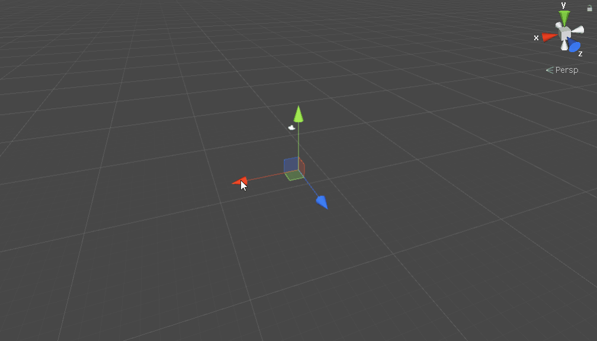

# Unity Marching Cubes

This project was born from the desire to explore and learn about the _marching cubes_ algoritm, as presented by William E. Lorensen and Harvey E. Cline in their paper: _**Marching Cubes: A High Resolution 3D Surface Construction Algorithm. Computer Graphics, 21 (4): 163-169, July 1987**_. Implementation results are presented in real-time using the _**UnityEngine**_ (https://unity.com/) rendering pipeline and C# scripting API.

The root of the repository may be loaded as a standalone Unity project directory, complete with a _**SampleScene**_ scene file within which users may wish to customize the parameters of different implicit shapes ( or *constant density* surfaces as denoted by the algorithm developers ) in order to alter the visual outcome statically or during application lifetime.

In addition, the code itself exposes relevant __*MonoBehaviour*__ component implementations to be controlled at runtime and contains some basic optimization techniques targeted at increasing general rendering speed.

## Visual Examples:

#### Plane:

#### Sphere:

#### Metaballs ( as invented by *Jim Blinn* in __*A generalization of algebraic surface drawing. ACM Transactions on Graphics (TOG), 1(3):235–256, 1982*__ ):

# License (__*MIT*__ ):

Copyright © 2019 _**Karim Takieddine**_

Permission is hereby granted, free of charge, to any person obtaining a copy of this software and associated documentation files (the "Software"), to deal in the Software without restriction, including without limitation the rights to use, copy, modify, merge, publish, distribute, sublicense, and/or sell copies of the Software, and to permit persons to whom the Software is furnished to do so, subject to the following conditions:

The above copyright notice and this permission notice shall be included in all copies or substantial portions of the Software.

THE SOFTWARE IS PROVIDED "AS IS", WITHOUT WARRANTY OF ANY KIND, EXPRESS OR IMPLIED, INCLUDING BUT NOT LIMITED TO THE WARRANTIES OF MERCHANTABILITY, FITNESS FOR A PARTICULAR PURPOSE AND NONINFRINGEMENT. IN NO EVENT SHALL THE AUTHORS OR COPYRIGHT HOLDERS BE LIABLE FOR ANY CLAIM, DAMAGES OR OTHER LIABILITY, WHETHER IN AN ACTION OF CONTRACT, TORT OR OTHERWISE, ARISING FROM, OUT OF OR IN CONNECTION WITH THE SOFTWARE OR THE USE OR OTHER DEALINGS IN THE SOFTWARE.

# Acknowledgements and sources of inspiration:

 - Paul Bourke: __*Polygonising a Scalar Field*__ (http://paulbourke.net/geometry/polygonise/)

 - Ben Kenwright: __*Metaballs & Marching Cubes, Blobby Objects and Isosurfaces*__ (http://www.xbdev.net/misc_demos/demos/marching_cubes/paper.pdf)

 - Microsoft: __*Write safe and efficient C# code*__ (https://docs.microsoft.com/en-us/dotnet/csharp/write-safe-efficient-code)